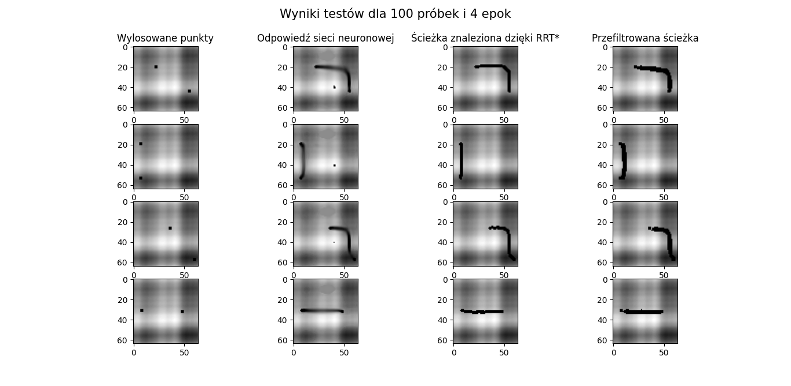

# mapr_project

# Dependencies:
```
$ sudo apt-get install ros-melodic-map-server ros-melodic-dwa-local-planner libompl-dev

$ sudo apt-get install ros-melodic-grid-map

$ pip install pathlib

$ pip install tqdm
```
# Installation
```
$ sudo apt-get update

$ cd ~/catkin_ws/src

$ git clone https://github.com/Kamilkim/mapr_project.git

$ cd ~/catkin_ws/

$ catkin_make_isolated

$ source devel_isolated/setup.bash
```
# Run example

Run map:

`$ roslaunch mapr_project mapr_project.launch`

Run map with path drawing:

`$ roslaunch mapr_project mapr_project_ompl.launch`


# Tasks

### 1. Map generation
Based on the information from the https://github.com/ANYbotics/grid_map repository, script generating 64x64 pixels shape elevation map was written. Subsequently map was saved to rosbag file.

<p align="center"> 

</p>

### 2. Drawing a starting and ending point
The scpipt sbscribes the elevation map from launched rosbag and draws two points on its surface - starting and ending point. Added restrictions cousing, that distance between tossed poinst is greater than 10 pxsels. Next those points are published into topic.

<p align="center"> 

</p>

### 3. Path finding
For path finding RRT* algorythm form OMPL library was used, additionally path was optimized in terms of cost, which is the elevation value on map at a given point. For cost optimization Optimization Objectives https://ompl.kavrakilab.org/optimizationObjectivesTutorial.html module was used. The planner node subsribes map from rosbag and randomly selects points form the topic, then finds and subscribes path into topic.

<p align="center"> 

</p>

### 4. Map saving
Node with planner is launched every second and with this frequency new points and fouded path are subscribed.

<p align="center"> 

</p>

Start and end points are saved as pictutres. Once path is found, it is also saved as an image file.  The brightnes value of pixels belonging to the map ranges from 30 to 255,while pixels belonging to the path have a value of 0. A set of images pairs (images with points and with paths) was used for neural network learning (which mimics RRT* algorythm).

<p align="center"> 


</p>

### 5. Neural network model
To solve given problem convolution U-net (seen below) was choose. Network model was implemented with help of PyTorch library. Network input is an elevation map image in grayscale with with drawn two points (start and end). Output is an  image of elevation map with drawn path.

<p align="center"> 

</p>

### 6. Neural network training 
Neural network training was conducted repeatedly, but due to poor computational capacity, only 2 promising models were obtained - first for training with a set containing 1000 samples for 4 epochs, second for 6000 samples set for 8 epochs. As stop condition, the similatity between reference images and output images at 97% level was set.

<p align="center"> 

</p>

<p align="center"> 

</p>

For the validation set, the similarity between reference images and output images reached 96% (for 6000 samples and 8 epochs). 
Beneath network error chart in relation to time and images projection accuracy chart in relation to epochs were presented.

<p align="center"> 

</p>

<p align="center"> 

</p>

### 7. Neural network testing
For network testing, a separate imagees set was generated. Due to the fact that the network was not copletely learned, additional filters were aplied to the output images to increase the contrast between the background (map) and the path. The similarity of the reference images with the images returned by the network got the level of 94%.

<p align="center"> 

</p>


