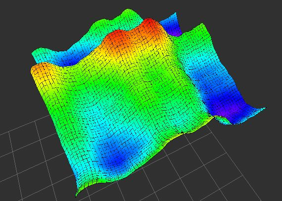
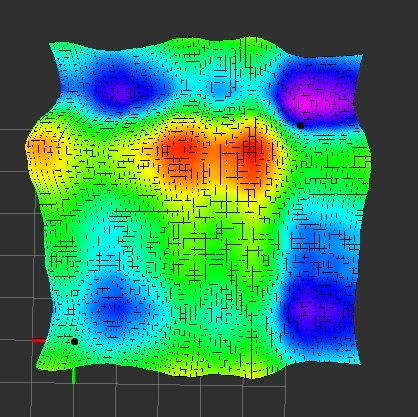
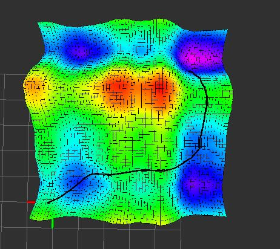
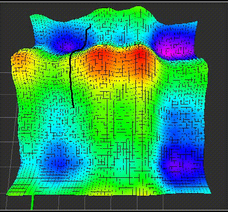
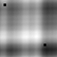
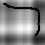
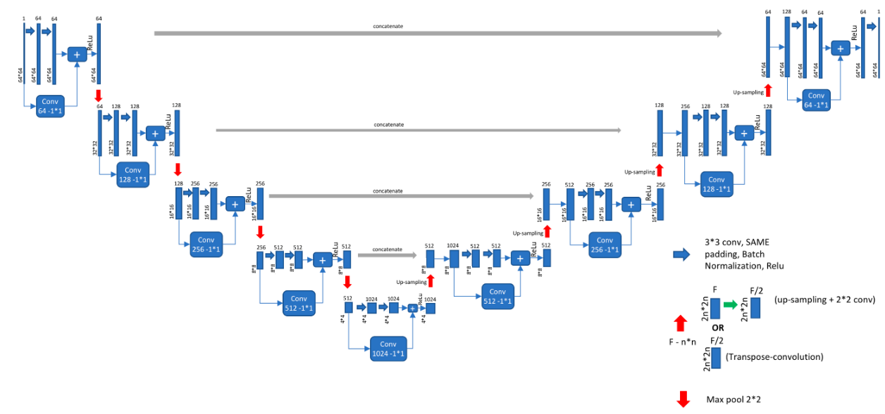
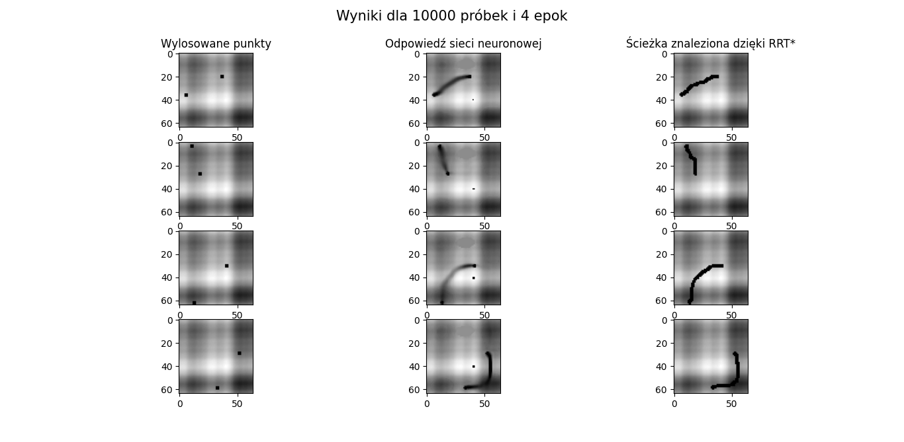
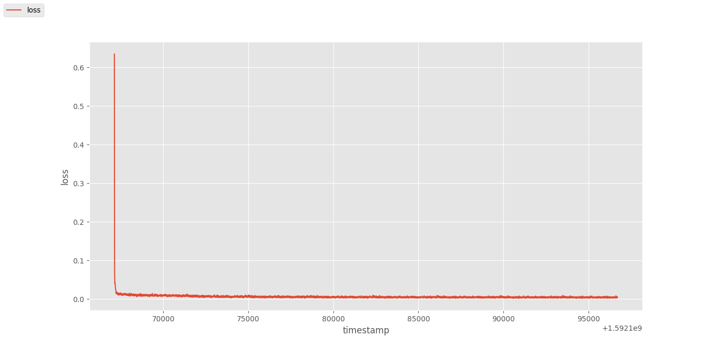
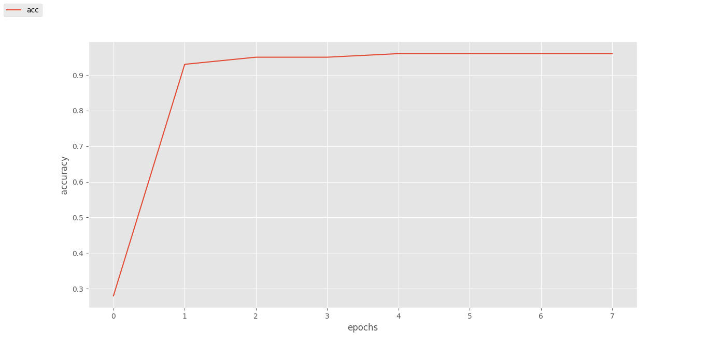

# mapr_project

# Dependencies:

$ sudo apt-get install ros-melodic-map-server ros-melodic-dwa-local-planner libompl-dev

$ sudo apt-get install ros-melodic-grid-map

$ pip install pathlib

$ pip install tqdm

# Installation

$ sudo apt-get update

$ cd ~/catkin_ws/src

$ git clone https://github.com/Kamilkim/mapr_project.git

$ cd ~/catkin_ws/

$ catkin_make_isolated

$ source devel_isolated/setup.bash

# Run example

Uruchomienie mapy:

$ roslaunch mapr_project mapr_project.launch

Uruchomienie mapy z rysowaniem sciezki

$ roslaunch mapr_project mapr_project_ompl.launch

# Tasks

### 1. Generowanie mapy 
Na podstawie informacji z repozytorium https://github.com/ANYbotics/grid_map zostal napisany skrypt elevMap_create.py, ktory generuje mape wysokosciowa (widoczna ponizej) o wymiarach 64x64 piksele. Mapa nastepnie zostala zapisana do rosbaga.

 

### 2. Losowanie punktu startowego i końcowego
Skrypt subsykrybuje mape wysokosciowa z uruchomionego rosbaga i losuje na jej powierzchn dwa punkty- startowy i koncowy. Dodane ograniczenie powoduje, ze punkty wostają wylosowane w odległści nie mniejszej niż 10 pikseli. Nastepnie punkty te sa publikowane w topiku.

 

### 3. Szukanie sciezki 
Do wyszukiwania sciezki zostal uzyty algotyrm RRT* z biblioteki OMPL, dodatkowo sciezka jest optymalizowana pod wzgledem kosztu, ktorym jest wysokosc na mapie w danym punktcie. Do optymalizacji kosztu uzyto rowniez elementu biblioteki OMPL - Optimization Objectives
https://ompl.kavrakilab.org/optimizationObjectivesTutorial.html. Node planera subskrybuje mape z rosbaga i losawane punkty z topika, nastepnie wyszukuje sciezke i publikuje ja w topiku.

 

### 4. Zapis mapy 
Node z planerem jest uruchamiany co sekunde i z taka czestotliwoscia sa subskybowane nowe punkty i wyszukiwana miedzy nimi sciezka.

 

Punkty startowy i koncowy sa zapisywane jako zdjecie, po znalezieniu sciezki rowniez ona zostaje zapisana w formacie obrazu. Zakres jasności pikseli należących do mapy miesci sie w zakresie od 30 do 255, natomiast piksele nalezace do sciezki maja wartosc 0. Zbior par zdjec (punktow i sciezki) zostal wykorzystany do uczenia sieci neuronowej, ktora nasladuje uzyty algorytm trasowania sciezki.

 

### 5. Model sieci neurownej 
Do rozwiazana problemu zostala wybrana siec konwolucyjna U-net o strukturze widocznej ponizej. Model sieci zostal zaimplementowany z uzyciem biblioteki PyTorch. Wejsciem sieci jest obraz mapy wysokosciowej w skali szarosci z zaznaczonymi na czarno dwoma punktami (startowy i koncowy). Wynikiem sieci jest obraz mapy wysokosciowej z narysowana siezka pomiedzy punktami.

 

### 6. Uczenie sieci 
Uczenie sieci przeprowadzono kilkukrotnie, jednak z uwagi na slabe mozliwosci obliczeniowe, udalo sie uzyskac jedynie 2 obiecujace modele- jeden dla uczenia zestawem posiadajacym 10000 probek przez 4 epoki, drugi dla 6000 probek przez 8 epok. Jako warunek zatrzymania uczenia ustawiono zgodnosc obrazow referencyjnych (z zestawu walidacyjnego) z obrazami wyjsciowymi sieci na pozomie nie niższym niż 97%.

 

 

Dla zestawu walidacyjnego zgodnosc obrazow referencyjnych z obrazami zwroconymi przez siec neuronowa (dla zestawu uczacego z 10000 probkami) wyniosla 96 %.
Ponizej przedstwaiono kolejno: wykres bledu sieci neuronowej w zaleznosci od czasu, dokladnosc odwzorowania obrazow referencyjnych w zaleznosci od epoki. Oba wykresy wyznaczono dla zestawu z 60000 probek.

 

 

### 6. Testowanie sieci 
Do testowania sieci wygenerowany zostal osobny zestaw obrazow. Z uwagi na to, ze siec nie jest do konca poprawnie nauczona, na obrazy wyjciowe z sieci neuronowej nalozono dodatkowe filtry, aby zwiekszyc kontrast miedzy tlem (mapa), a sciezka. Zgodnosc obrazow referencyjnych z obrazami zwroconymi przez siec dla zestawu treningowego jest na poziomie 94 %

 

